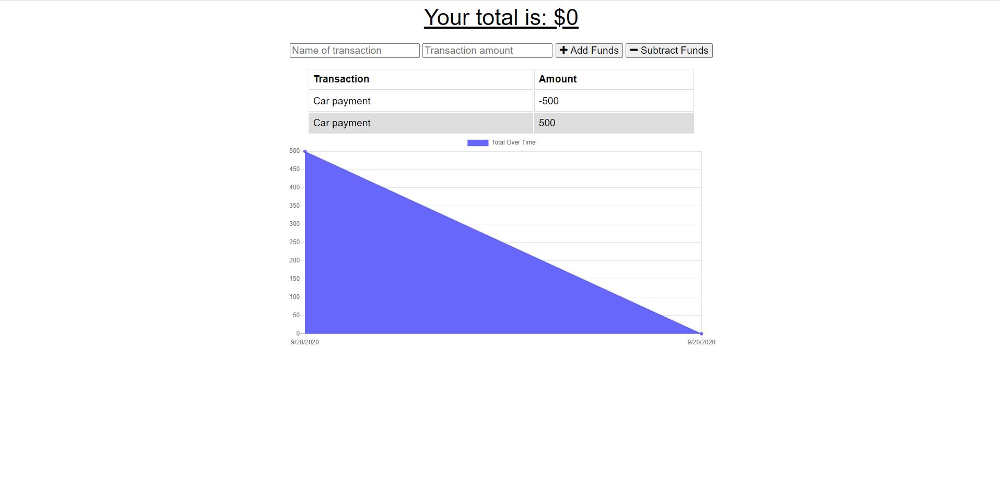

# Online-Offline-Budget-Trackers
AS AN avid traveller
The user is able to track  withdrawals and deposits with or without a data/internet connection
SO THAT the account balance is accurate when I am traveling

Giving users a fast and easy way to track their money is important, but allowing them to access that information anytime is even more important. Having offline functionality is paramount to our applications success.

## Screenshot
